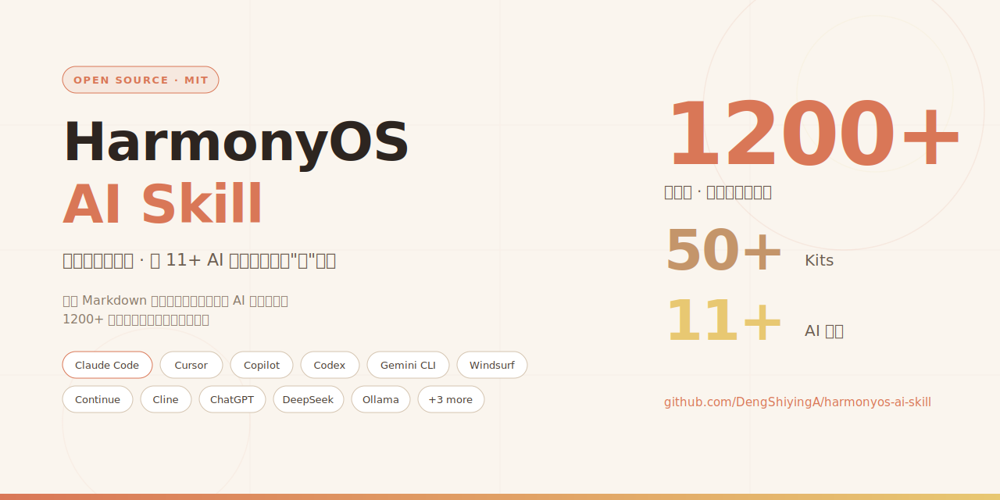
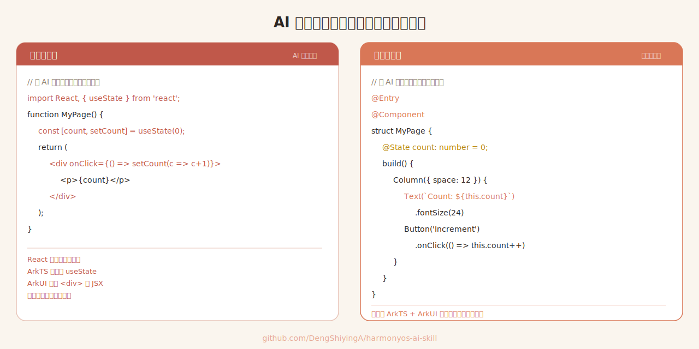
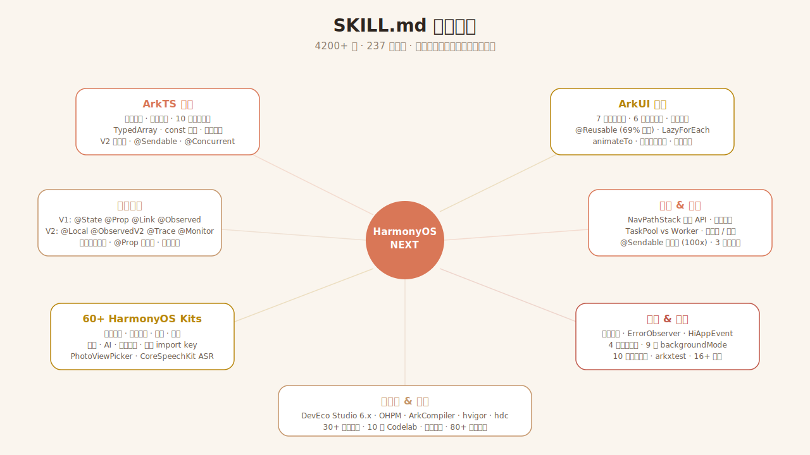

<div align="center">

[English](./README_EN.md) | **简体中文**



# 🧠 HarmonyOS AI Skill

### 鸿蒙开发知识包 · 让 11+ AI 编程工具真正"懂"鸿蒙

*"让 AI 像熟读华为文档的工程师一样，帮你写 ArkTS / ArkUI"*

[](./LICENSE)
[](https://developer.huawei.com/consumer/cn/)
[](https://developer.huawei.com/consumer/cn/doc/harmonyos-guides-V5/arkts-get-started-V5)
[](#supported-ai-tools)
[](https://agents.md)

[](https://github.com/DengShiyingA/harmonyos-ai-skill/stargazers)
[](https://github.com/DengShiyingA/harmonyos-ai-skill/commits)
[](https://github.com/DengShiyingA/harmonyos-ai-skill/issues)

<br/>

**用 Cursor 写鸿蒙，AI 给你输出 React？**
**让 Claude 改 `module.json5`，它写成 `package.json`？**
**问 Copilot `@ObjectLink` 咋用，它说"这 API 不存在"？**

问题不在 AI —— 在于没人给它喂过鸿蒙知识。

**所以我喂了。一份 Markdown 源文件，自动产出 11+ AI 工具的配置。**

<br/>

[🚀 安装](#安装) · [📖 知识内容](#知识包内容) · [🛠️ 支持的工具](#支持的-ai-工具) · [✅ 验证效果](#验证是否生效)

</div>

---

<div align="center">

</div>

---

## ⚡ 快速开始（Claude Code，30 秒）

```bash
git clone https://github.com/DengShiyingA/harmonyos-ai-skill.git ~/src/harmonyos-ai-skill
mkdir -p ~/.claude/skills
ln -s ~/src/harmonyos-ai-skill/harmonyos-development ~/.claude/skills/harmonyos-development
# 重启 Claude Code，然后问："What skills are available?"
```

用其他工具？查看[下方完整安装指南](#安装)。

---

只维护一份知识源文件 [`harmonyos-development/SKILL.md`](./harmonyos-development/SKILL.md)，即可自动产出所有 AI 工具的配置文件。

<details>
<summary><b>🤔 什么是 "skill"（技能包）？</b>（点击展开）</summary>

Skill 是一段领域知识（Markdown 格式），AI 编程工具会在对话时自动加载为背景上下文。安装后，AI 就"知道"了这个领域——它会给出符合 HarmonyOS 规范的回答，而不是泛泛的 TypeScript / React 建议。不同工具叫法不同（skills、rules、instructions、system prompt），但原理一样：**额外文本被插入到模型的上下文中**。

</details>

**依赖：** 只需 `git` 和 `curl`（或直接复制粘贴）。无其他依赖。

## 知识包内容

<div align="center">

</div>

这份知识包教会 AI 读写、审查和调试 HarmonyOS NEXT 原生应用所需的一切（约 1200 行密集、可操作的知识）：

- **语言与框架** — ArkTS 严格模式规则、命名规范、10 条高性能编码规则（const、TypedArray、稀疏数组、闭包、缓存）、编码风格指南
- **应用架构** — Stage 模型：UIAbility、ExtensionAbility、AbilityStage、WindowStage 生命周期；module.json5 / app.json5 配置
- **ArkUI 组件** — 组件生命周期（7 个回调 + 执行顺序）、6 种布局容器（Column/Row/Stack/Flex/RelativeContainer/List）性能对比、`@Reusable` 组件复用模式（提速 69%）
- **状态管理** — V1 装饰器（`@State`、`@Prop`、`@Link`、`@Provide`/`@Consume`、`@Observed` + `@ObjectLink`、`@Watch`）+ V2 装饰器（`@ComponentV2`、`@Local`、`@ObservedV2` + `@Trace`、`@Monitor`），含观察深度规则和性能指导
- **导航路由** — `Navigation` + `NavPathStack` 完整 API（push/pop/replace/remove/query/interception），3 种显示模式，`@Builder` navDestination 模式
- **动画** — `animateTo()`、`.animation()`、Curve 枚举、弹簧曲线、`geometryTransition` 共享元素转场
- **性能优化** — `LazyForEach` + IDataSource、`cachedCount`、布局嵌套规则（最多 3 层）、`if/else` vs `.visibility()`、`Flex` vs `Column`/`Row`
- **HarmonyOS Kits** — 7 大类 50+ Kit（应用框架、应用服务、系统、媒体、图形、AI、开发工具）含 import key
- **并发** — TaskPool vs Worker 对比、`@Concurrent` 规则、`@Sendable` 共享堆机制（快 100 倍）、任务优先级/分组/延迟/周期
- **稳定性** — 崩溃类型分类（JS_ERROR/CPP_CRASH/APP_FREEZE/OOM）、全局错误处理、HiAppEvent 崩溃订阅
- **后台任务** — 4 种类型（短时/长时/延迟/提醒代理）、9 种后台模式、频率限制
- **安全** — 10 条编码规则、权限检查/请求模式、数据加密等级（EL1–EL4）
- **测试** — arkxtest 框架（JsUnit 16+ 断言、UiTest 选择器/交互）、测试项目结构
- **多设备** — 响应式断点（xs/sm/md/lg/xl）、GridRow/GridCol、折叠屏适配
- **打包** — HAP/HSP/HAR、原子化服务、分布式特性（流转）
- **工具链** — DevEco Studio 6.x 配置（hvigor）、OHPM、ArkCompiler、仓颉（beta）
- **示例与参考** — 10 类官方示例目录、30+ 最佳实践链接（按主题分类）、10 个 Codelab、培训课程、80+ 已验证文档链接

---

## 支持的 AI 工具

### 1. 原生 skill 格式（按描述自动匹配加载）

| 工具 | 安装路径 | 激活方式 |
|---|---|---|
| **Claude Code CLI** | `~/.claude/skills/harmonyos-development/` | Claude 读取 `SKILL.md` frontmatter 中的 `description`，当你的问题涉及 HarmonyOS / ArkTS / ArkUI / Stage 模型等时自动加载，无需手动调用 |
| **Claude Agent SDK** | 将 `harmonyos-development/` 放在任意位置，通过 SDK 的 `skills` 参数指定 | 同 Claude Code —— 基于描述自动加载 |

### 2. 项目规则文件（项目内每次会话自动附加）

| 工具 | 安装路径 | 源文件 | 作用域 |
|---|---|---|---|
| **Cursor**（现代版） | `.cursor/rules/harmonyos.mdc` | `dist/cursor/harmonyos.mdc` | 按 glob 匹配 `*.ets`、`module.json5`、`oh-package.json5`、`build-profile.json5` |
| **Cursor**（旧版） | `.cursorrules`（仓库根目录） | `dist/cursor/.cursorrules` | 始终生效 |
| **GitHub Copilot** | `.github/copilot-instructions.md` | `dist/copilot/copilot-instructions.md` | 仓库内始终生效 |
| **Windsurf / Codeium** | `.windsurfrules`（仓库根目录） | `dist/windsurf/.windsurfrules` | 始终生效 |
| **Continue.dev** | `.continue/rules/harmonyos.md` | `dist/continue/harmonyos.md` | 始终生效 |
| **Cline / Roo Code** | Settings → Custom Instructions | `dist/cline/custom-instructions.md` | 按工作区或全局 |
| **OpenAI Codex CLI · sst/opencode · Amp · Aider · Jules** | `AGENTS.md`（仓库根目录） | `dist/agents-md/AGENTS.md` | 遵循 [AGENTS.md](https://agents.md) 标准 |
| **Google Gemini CLI** | `GEMINI.md`（仓库根目录）或 `~/.gemini/GEMINI.md`（全局） | `dist/gemini-cli/GEMINI.md` | Gemini CLI 读取任一路径 |

### 3. 通用 —— 粘贴到任何聊天 / API

| 工具 | 粘贴位置 | 源文件 |
|---|---|---|
| **ChatGPT / GPT-4 / GPT-5** | Settings → Personalization → Custom Instructions（或单次对话 system prompt） | `dist/plain/harmonyos-knowledge.md` |
| **Google Gemini / AI Studio** | System Instructions 字段 | `dist/plain/harmonyos-knowledge.md` |
| **DeepSeek / Qwen / 文心一言 / Kimi / 智谱** | 系统提示 / 角色设定字段 | `dist/plain/harmonyos-knowledge.md` |
| **Ollama 本地模型** | `--system` 参数 | `dist/system-prompt/system.txt` |
| **Anthropic / OpenAI / 任意 LLM API** | 请求体的 `system` 消息 | `dist/system-prompt/system.txt` |

两个文件区别很小：`plain/` 是原始 Markdown；`system-prompt/` 在前面加了一句角色定位（*"You are an expert HarmonyOS NEXT developer…"*）。

---

## 安装

下方所有 `curl` 命令都使用环境变量 `$RAW` —— 先在终端运行一次（在当前 session 中持续有效）：

```bash
export RAW=https://raw.githubusercontent.com/DengShiyingA/harmonyos-ai-skill/main
```

### Claude Code CLI

选择以下三种方式之一：

```bash
# 方式 A — 直接复制（获得静态快照）
git clone https://github.com/DengShiyingA/harmonyos-ai-skill.git ~/src/harmonyos-ai-skill
mkdir -p ~/.claude/skills
cp -r ~/src/harmonyos-ai-skill/harmonyos-development ~/.claude/skills/

# 方式 B — 符号链接（推荐：git pull 后自动更新）
git clone https://github.com/DengShiyingA/harmonyos-ai-skill.git ~/src/harmonyos-ai-skill
mkdir -p ~/.claude/skills
ln -s ~/src/harmonyos-ai-skill/harmonyos-development ~/.claude/skills/harmonyos-development

# 方式 C — 仅项目级别（提交后团队共享）
cd <你的鸿蒙项目>
mkdir -p .claude/skills
cp -r ~/src/harmonyos-ai-skill/harmonyos-development .claude/skills/
```

安装后**重启 Claude Code**。验证方法：问 *"What skills are available?"* —— 应该列出 `harmonyos-development`。

### Cursor

```bash
# Recommended — modern glob-scoped .mdc rule
mkdir -p .cursor/rules
curl -o .cursor/rules/harmonyos.mdc "$RAW/dist/cursor/harmonyos.mdc"

# OR legacy single-file rules (if your Cursor version predates .mdc)
curl -o .cursorrules "$RAW/dist/cursor/.cursorrules"
```

`.mdc` 规则仅在编辑 `.ets`、`module.json5` 等文件时自动激活，非鸿蒙项目不会占用上下文。

### GitHub Copilot

```bash
mkdir -p .github
curl -o .github/copilot-instructions.md "$RAW/dist/copilot/copilot-instructions.md"
```

在仓库内对 Copilot Chat 和内联建议始终生效。提交后团队共享。

### Windsurf / Codeium

```bash
curl -o .windsurfrules "$RAW/dist/windsurf/.windsurfrules"
```

### Continue.dev

```bash
mkdir -p .continue/rules
curl -o .continue/rules/harmonyos.md "$RAW/dist/continue/harmonyos.md"
```

### Cline / Roo Code

1. Download the file: `curl -o harmonyos-instructions.md "$RAW/dist/cline/custom-instructions.md"`
2. In VS Code: open Cline / Roo settings → **Custom Instructions**
3. Paste the file contents into the workspace or global instructions field

### AGENTS.md standard (Codex CLI, opencode, Amp, Aider, Jules)

一个文件即可服务**所有**遵循 [AGENTS.md 标准](https://agents.md) 的工具：

```bash
curl -o AGENTS.md "$RAW/dist/agents-md/AGENTS.md"
```

用户级（全局）作用域，各工具读取不同路径：

| 工具 | 全局路径 |
|---|---|
| OpenAI Codex CLI | `~/.codex/AGENTS.md` |
| sst/opencode | `~/.config/opencode/AGENTS.md` |
| Amp | `~/.config/amp/AGENTS.md` |
| Aider | 仅读取当前目录的 `AGENTS.md` |

部分工具支持多层 `AGENTS.md`（最近的优先 / 合并），详见各工具文档。

### Google Gemini CLI

```bash
# Project-level (takes precedence):
curl -o GEMINI.md "$RAW/dist/gemini-cli/GEMINI.md"

# Global (applies to every Gemini CLI session):
mkdir -p ~/.gemini
curl -o ~/.gemini/GEMINI.md "$RAW/dist/gemini-cli/GEMINI.md"
```

### ChatGPT / Gemini web / DeepSeek / Qwen / Kimi / 文心一言

1. 在 GitHub 上打开 [`dist/plain/harmonyos-knowledge.md`](./dist/plain/harmonyos-knowledge.md)
2. 点击 **Raw** → **Ctrl/Cmd + A** → **Ctrl/Cmd + C**
3. 在你的 AI 工具中：
   - **ChatGPT:** Settings → Personalization → **Custom Instructions** → "How would you like ChatGPT to respond?" → 粘贴
   - **Gemini web:** 新建对话 → 启用 **System Instructions** → 粘贴
   - **DeepSeek / Qwen / 文心一言 / Kimi:** 创建"智能体" / "角色" / "Bot" → 粘贴到系统提示
4. 开始提问鸿蒙开发问题 —— AI 已加载知识

### Ollama / 本地模型

```bash
# 先拉取模型
ollama pull qwen2.5-coder:14b

# 带鸿蒙系统提示启动
ollama run qwen2.5-coder:14b \
  --system "$(curl -s $RAW/dist/system-prompt/system.txt)"
```

或者写入自定义 Modelfile：

```bash
# 1. Download the system prompt
curl -o system.txt "$RAW/dist/system-prompt/system.txt"

# 2. Create a Modelfile (replace the SYSTEM block contents with the file you just downloaded)
cat > Modelfile <<EOF
FROM qwen2.5-coder:14b
SYSTEM """
$(cat system.txt)
"""
EOF

# 3. Register the custom model
ollama create harmonyos-coder -f Modelfile
ollama run harmonyos-coder
```

### Anthropic / OpenAI / 任意 LLM API

```python
# Python 示例
import anthropic
client = anthropic.Anthropic()

with open("dist/system-prompt/system.txt") as f:
    system_prompt = f.read()

response = client.messages.create(
    model="claude-opus-4-6",
    system=system_prompt,
    max_tokens=2048,
    messages=[{"role": "user", "content": "How do I make a service card in HarmonyOS?"}],
)
```

---

## 各工具的激活方式

| 工具类别 | 触发机制 | 始终开启？ |
|---|---|---|
| **Claude Code / Agent SDK** | LLM 读取 skill 的 `description`，判断当前对话是否需要加载 | 否 —— 按需加载，节省上下文 |
| **Cursor `.mdc`** | Glob 模式匹配当前文件 | 仅 `.ets` / 鸿蒙配置文件 |
| **Cursor `.cursorrules`、`.windsurfrules`、Copilot instructions、AGENTS.md、GEMINI.md、Continue / Cline rules** | 项目内每次对话都会注入 | 是 |
| **ChatGPT / Gemini Custom Instructions** | 账号下每次对话都会注入 | 是 |
| **单次粘贴 / API `system`** | 仅粘贴的那次对话 | 按次 |

**经验法则：** 纯鸿蒙项目用"始终开启"的规则文件；混合仓库（如同时有 Android 和鸿蒙代码）用 Cursor 的 `.mdc` 按文件类型匹配，或 Claude Code 的按描述加载。

---

## 验证是否生效

问 AI：

> *"解释 ArkUI 中 `@ObjectLink` 是什么，什么时候用它代替 `@State`？"*

回答**正确加载**的标志：

- ✅ 提到必须用 `@Observed` 装饰类，`@ObjectLink` 才能工作
- ✅ 提到 `@State` 作用于对象数组时，只响应数组操作（push/splice/重新赋值），不响应单个元素的属性变化
- ✅ 提到在行组件中用 `@ObjectLink` 来观察元素级别的变化
- ✅ 或提到整体重新赋值对象来触发重新渲染

如果回答模糊或像 React（"用 state hook"），说明知识**未加载**。

其他验证问题：

- "FA 模型和 Stage 模型有什么区别？"
- "鸿蒙中如何声明和动态申请权限？"
- "HTTP 请求用哪个 Kit？"
- "怎么开发服务卡片？"

---

## 仓库结构

```
harmonyos-ai-skill/
├─ .gitignore
├─ LICENSE
├─ README_EN.md
├─ harmonyos-development/
│  └─ SKILL.md                          ← 唯一的知识源文件，只编辑这里
├─ scripts/
│  └─ build-dist.sh                     ← 重新生成所有 dist/ 文件
├─ dist/                                ← 自动生成 —— 不要手动编辑
│  ├─ claude-code/harmonyos-development/SKILL.md
│  ├─ cursor/harmonyos.mdc
│  ├─ cursor/.cursorrules
│  ├─ copilot/copilot-instructions.md
│  ├─ windsurf/.windsurfrules
│  ├─ continue/harmonyos.md
│  ├─ cline/custom-instructions.md
│  ├─ agents-md/AGENTS.md
│  ├─ gemini-cli/GEMINI.md
│  ├─ plain/harmonyos-knowledge.md
│  └─ system-prompt/system.txt
└─ README.md
```

**单源工作流：**

1. 编辑 `harmonyos-development/SKILL.md`
2. 运行 `./scripts/build-dist.sh`
3. 同时提交源文件和重新生成的 `dist/`

---

## 更新到最新版本

```bash
cd /path/to/your/clone
git pull
./scripts/build-dist.sh
# 然后重新复制你所用工具的配置文件
```

如果是通过 `ln -s` 安装的，只需 `git pull` —— 符号链接会自动获取最新内容。

---

## 编写你自己的 skill

源格式是 Claude Code 的 `SKILL.md` —— YAML frontmatter + Markdown 正文：

```markdown
---
name: my-skill-name
description: >
  第一句：这个 skill 涵盖的领域。
  然后列出 AI 可能匹配的所有触发短语：
  关键词、API 名称、命令名、用户问题、同义词。
---

# My Skill

## 何时使用
- 具体场景的列表

## 参考资料
密集、可引用的资料：表格、代码片段、API 签名、
规则、陷阱。避免废话，多用列表和紧凑示例。
```

### 编写指南

- **聚焦** —— 一个 skill 一个领域，不要混合鸿蒙 + iOS + Android
- **密集** —— 删掉每一句不能教会 AI 新知识的话
- **触发词丰富** —— 在 `description` 中列出所有可能的用户表达方式（中英文都写）。LLM 的匹配是模糊的，但显式关键词能提高命中率
- **可操作** —— 优先用具体的代码/配置片段，而非抽象解释
- **诚实面对空白** —— 如果某功能已弃用就说明，没有数据就不写

编辑源文件后，运行 `./scripts/build-dist.sh` 重新生成 `dist/` 下的所有工具配置。

---

## 故障排除

**AI 仍然给出泛泛的 TypeScript/React 回答**
- 确认文件放在了正确的路径（见上方*支持的 AI 工具*表格）
- Claude Code：运行 *"What skills are available?"* —— 如果没有列出 `harmonyos-development`，重启 Claude Code 或检查 `~/.claude/skills/`
- 项目规则工具（Cursor、Copilot 等）：确保你编辑的文件在**规则文件所在的仓库内**，规则不会在仓库外生效
- 粘贴类工具（ChatGPT、DeepSeek 等）：系统提示是按对话生效的，粘贴后要**开新对话**

**规则文件太长，超出工具的上下文限制？**
不太可能 —— `SKILL.md` 约 1200 行（~45 KB），所有列出的工具都能接受。如果确实遇到限制，手动裁剪 `dist/plain/harmonyos-knowledge.md`。

**`curl` 返回 404？**
URL 中的分支可能已变更。检查 `https://github.com/DengShiyingA/harmonyos-ai-skill/branches` 并更新 `$RAW`。

**上游仓库更新后怎么同步？**
见上方*更新到最新版本*章节。

---

## 许可证与贡献

基于 **MIT 协议** 开源 —— 个人和商业项目均可自由使用。

欢迎贡献：
1. Fork 本仓库
2. 编辑 `harmonyos-development/SKILL.md`（**唯一**需要编辑的文件 —— `dist/` 是自动生成的）
3. 运行 `./scripts/build-dist.sh` 重新生成配置文件
4. 同时提交源文件和 `dist/`，然后开 PR

欢迎提交：事实纠正、新的 gotcha、更新的 API 名称、description 字段的翻译（提高触发匹配率）。
